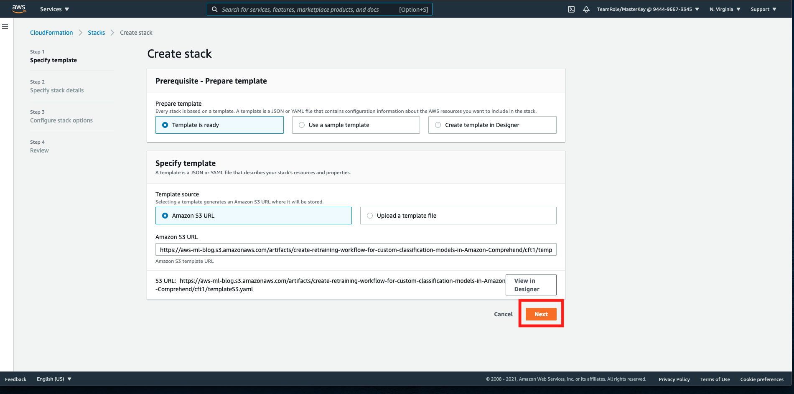
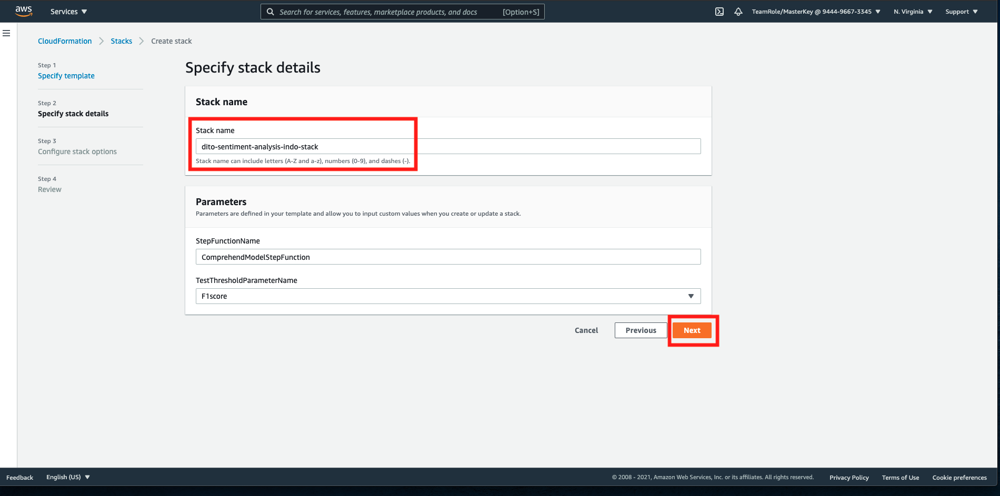
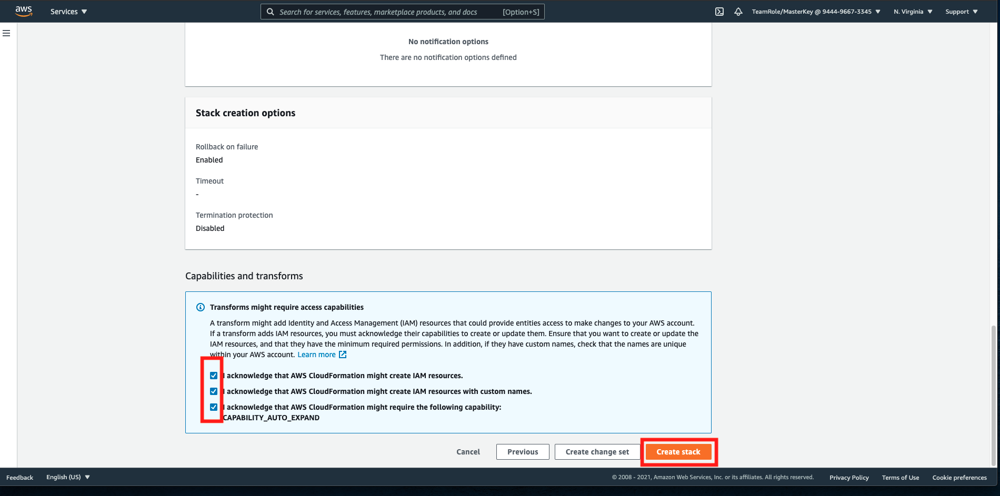
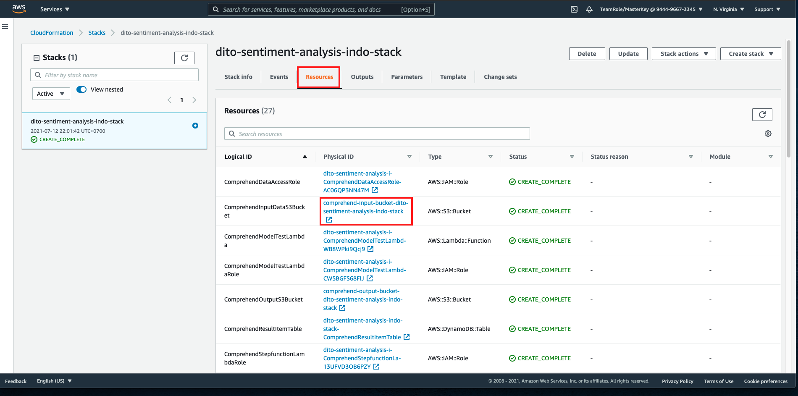
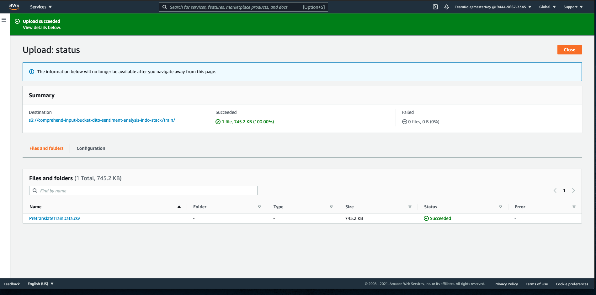
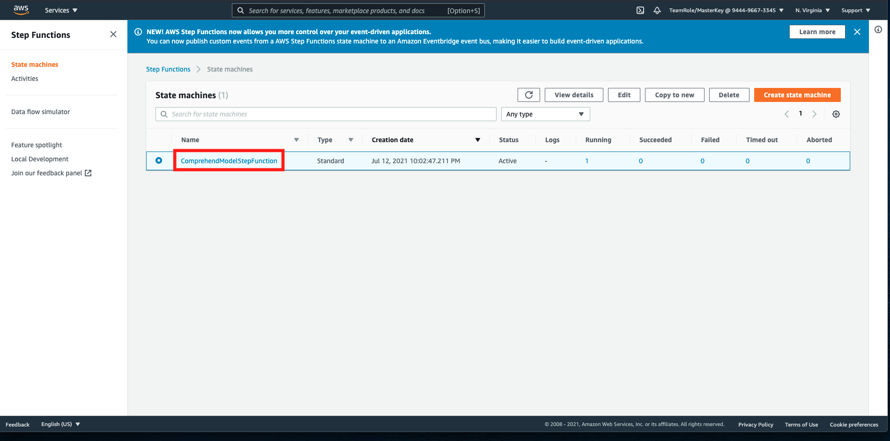
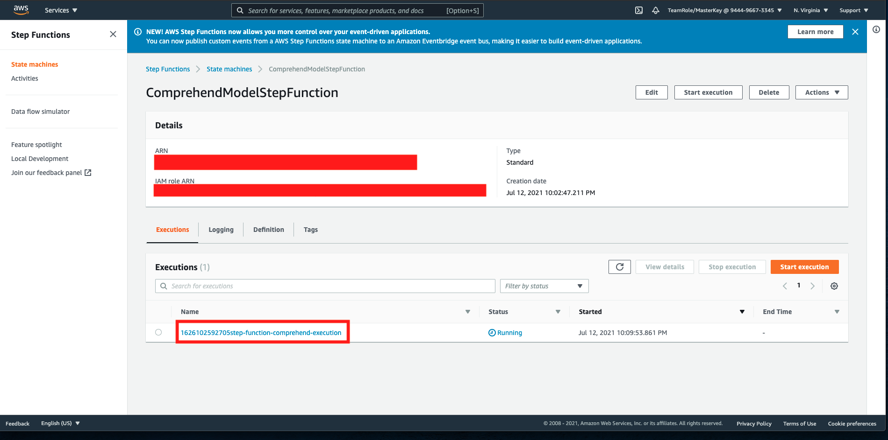
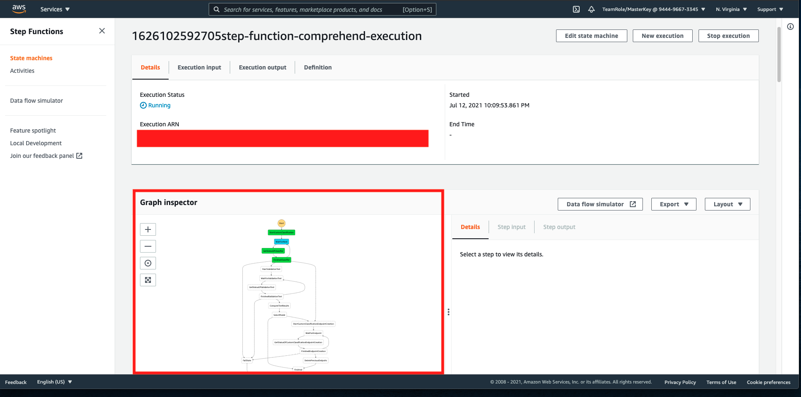

## Sentiment Analysis on AI Services

Note: this is using us-east-1 region.

for AI Services, we are going to use Comprehend, NLP Service on AWS. Currently, there are only limited [supported languages on Comprehend here](https://docs.aws.amazon.com/comprehend/latest/dg/supported-languages.html). But, that doesn't mean we can't use it. There are several ways to do it, and one of them is to translate the content from other language to English.

On this workshop since we have used Indonesian language, we will use pre-translated data from previous workshop (Indonesian to English language). It has been translated using Amazon Translate, by following [this approaches](https://aws.amazon.com/blogs/machine-learning/translating-documents-with-amazon-translate-aws-lambda-and-the-new-batch-translate-api/)

This step is following [this AWS Blog](https://aws.amazon.com/blogs/machine-learning/active-learning-workflow-for-amazon-comprehend-custom-classification-part-1/)

1. go to [this link](https://console.aws.amazon.com/cloudformation/home?region=us-east-1#/stacks/create/template?templateURL=https://aws-ml-blog.s3.amazonaws.com/artifacts/create-retraining-workflow-for-custom-classification-models-in-Amazon-Comprehend/cft1/templateS3.yaml). It will open CloudFormation page.

CloudFormation is a service that runs the infrastructure based on code. it will create a template of infrastructure (on YAML, or JSON file) that is useful for scalability and reusability of the infrastructure.

2. click `Next`

3. In stack name, fill it with `<yourname>-SentAnalysis-indo-stack` and click `next`

4. in configure stack options, and advanced options, click `Next` at bottom right
5. in review page, make sure to check all 3 of the checkboxes at `Capabilities and transforms` and click `Create stack`

this might take around 10 minutes to be deployed successfully. Once it's done, let's open the S3 bucket it has been created and upload the pre-translated data there.

6. Download [this pre-translated data](../files/PretranslateTrainData.csv) (you might need to open this in new tab, click raw, and save as .csv file)
7. in cloudformation console, click `Resources` tab and look for `ComprehendInputDataS3Bucket`.
8. click the link in physical ID next to `ComprehendInputDataS3Bucket`

9. in the S3 bucket, click `Create folder`
10. fill the folder name with `train`
11. click `Create folder`
12. open your `train` folder
13. drag and drop your `PretranslateTrainData.csv` to S3 bucket.
14. click `Upload` and click `Close`

Now, the uploaded file triggers the workflow of the process to execute and run Comprehend. This workflow is being created by AWS Service, Step Function. Step Function helps to create a workflow that consists of several functions. This functions is being created on other AWS Service, called Lambda. So lambda is a function-as-a-service, and Step Function is to orchestrate the lambda function.

Let's try to open the workflow.

15. go to [Step Function Console](https://console.aws.amazon.com/states/home?region=us-east-1)
16. click your state machine name `ComprehendModelStepFunction`

17. in executions, click the name

18. it will open the workflow for the comprehend to run

This workflow is currently running, since there is an insert event on S3. The file insertion on S3 triggers the workflow to run and create the comprehend model for us, using Custom classification. this might take 1 hour to complete.

Alternatively, you can also try to change the data by using [original not translated data here](../files/IndonesianTweetLabelled.csv), with negative label is -1, neutral is 0, and positive is 1. but, you need to create new stack, following from step 1.

[BACK TO WORKSHOP GUIDE :house:](../README.md)

[CONTINUE TO NEXT GUIDE :arrow_right:](DataLabelling.md)

[BACK TO PREVIOUS GUIDE :arrow_left:](DataSource.md)