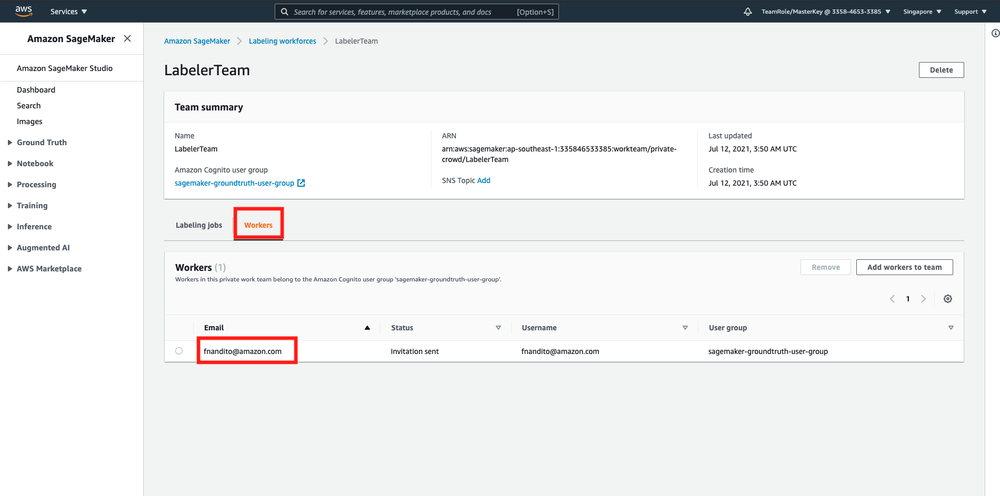

## Data Labelling using SageMaker Ground Truth

Note: this is using us-east-1, also working on ap-southeast-1 (need to clarify on s3 bucket in singapore region)

SageMaker Ground Truth is a segment on SageMaker, ML Platform on AWS that helps to label the data you would like to process on Machine Learning. For more description, please click [here](https://docs.aws.amazon.com/sagemaker/latest/dg/sms.html)

1. Go to [AWS Console](https://ap-southeast-1.console.aws.amazon.com/console/home?region=ap-southeast-1#)
2. type `SageMaker` at the search bar


3. click `Ground Truth` menu at the right side.
4. click `Labeling workforces` at the submenu.
5. click `Private` tab.


There are 3 ways to label your data on SageMaker Ground Truth:
* Mechanical Turk
    On-demand workers that can help to label the data. there is a human that will label your own data, given your description on how to label your data.
* Private
    Your own team will label the data, by creating private team for label and assign it to individuals by email.
* Vendor
    3rd party vendor that will help you to label your data. by using AWS Marketplace, you will be able to ask for their service.

For current workshop, we're going to use Private way.

6. on Private tab, click `Create private team`
7. in create private team page, choose `Create a private team with AWS Cognito`

AWS Cognito is a service that helps for authentication and authorization for users in a system. In this case, since there will be users who are going to label the data, they require authroization to label it.

10. Fill the team name with `LabelerTeam`
11. in add workers, choose `invite new workers by email`
12. fill your email address


13. fill the organization name and contact email. for contact email, you can fill your own email again.
14. click `Create private team`


15. in your private team, click your team name (`LabelerTeam`)


16. click `Workers` tab
17. Make sure your email is there.




You will receive an email invitation to label the data. Open it later.

Once it's done, let's go back to Ground Truth to set the label job.

18. go to [SageMaker Console](https://ap-southeast-1.console.aws.amazon.com/sagemaker/home?region=ap-southeast-1#/landing)
19. click `Ground Truth` menu at the left side and click `Labeling Job`
20. click `Create labelling job`


21. in job overview page, fill the job name with `SentimentAnalysisIndoJobLabel`
22. in input data setup, choose `Automated data setup`


23. click `Browse S3` button
24. choose your bucket with name `<yourname>-sentiment-indo-data`, and click `Choose`
25. in data type, click `Text`


26. in IAM Role, click the dropdown and click `Create a new role`
27. in S3 bucket, click `Any S3 bucket`


28. click `Create`

it will create a role for us to access the data from S3.

29. click `Complete data setup` button


this will create a manifest file, acts as a pointer that the data will be used to label your data.

it will show connection successful once you clicked it.


30. in task category, choose `Text`
31. in task selection, choose `Text Classification (Single Label)`
32. click `Next`


33. in your worker types, choose `Private`
34. in private teams, choose your teams that you have created before.
35. set the task timeout to 5 minutes, and task expiration time to 5 days
36. in text classification labelling tool, copy this brief description and paste it:

```
For each comments, select the comment from the list and pick which one do you think is the sentiment for the specific comment. One Sentence can only be labelled as 1 sentiment only.
```

37. in the left section for label instruction, please copy and paste this instruction:
```
Positive: Saying Gratitude, thankful, and giving positive comment
Example: Terima kasih. Penjelasan sangat membantu.

Neutral: Giving unbiased, yet not negative comment
Example: Saya masih ragu untuk memutuskan produk mana yang akan saya beli

Negative: Saying the case is not resolved, bad experience for customer, not helpful.
Example: Pelayanan tidak membantu sama sekali. Tidak ada jalan keluarnya
```

38. in options, click `Add new label`, and fill it with positive, neutral, and negative.
39. click `Create`


you need to wait for 5 minutes for the label to come up to the label website. Once it's done, Now your private labeller team can label it for you.

40. open your email from AWS about label invitation.


41. click the `https` link. it will open the page for you to label your data.
42. fill username and password.
43. It will ask to change the password. please change it.


once it's done, you can see the view

44. click the radio button besides the job, and click `Start Working` at the top right page.
45. in the job page, you can click the instruction button to display the instruction you have insereted.
46. based on the text, please choose 1 for the label, and click submit.


47. repeat this process until it's done.
48. to check the labelled result, go to your [S3 console](https://s3.console.aws.amazon.com/s3/home?region=ap-southeast-1#)
49. click your bucket name
50. open your SageMaker Ground Truth Job Name `SentimentAnalysisIndoJobLabel/`, click `annotations/`, click `consolidated-annotation/`, click `consolidation-response/`, and click `iteration-1/`. it will display JSON Files for your label result.

[BACK TO WORKSHOP GUIDE :house:](../README.md)

[CONTINUE TO NEXT GUIDE :arrow_right:](DevelopmentSM.md)

[BACK TO PREVIOUS GUIDE :arrow_left:](AIServices.md)