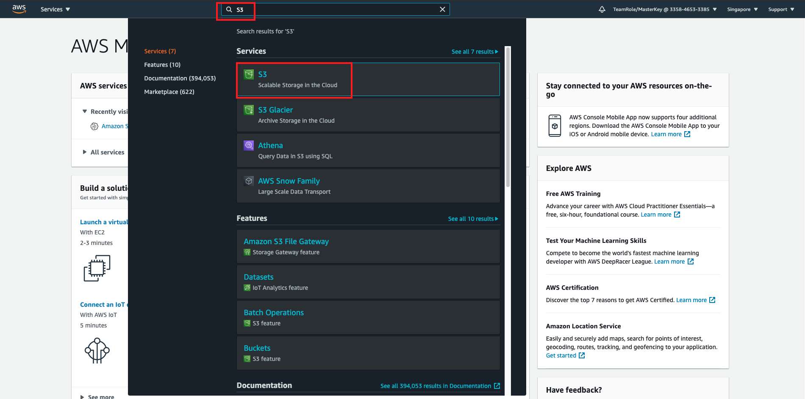
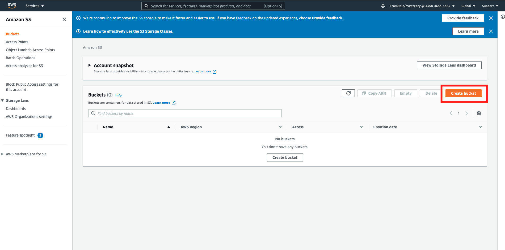
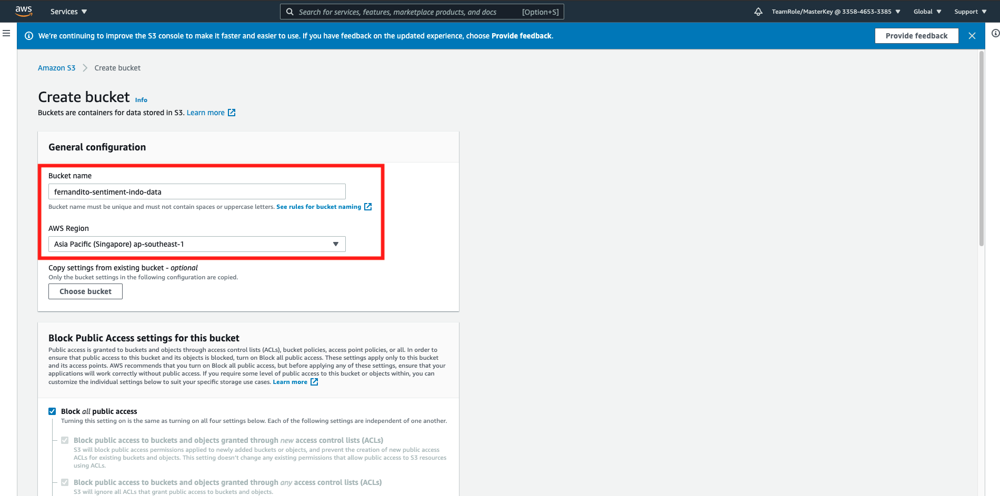
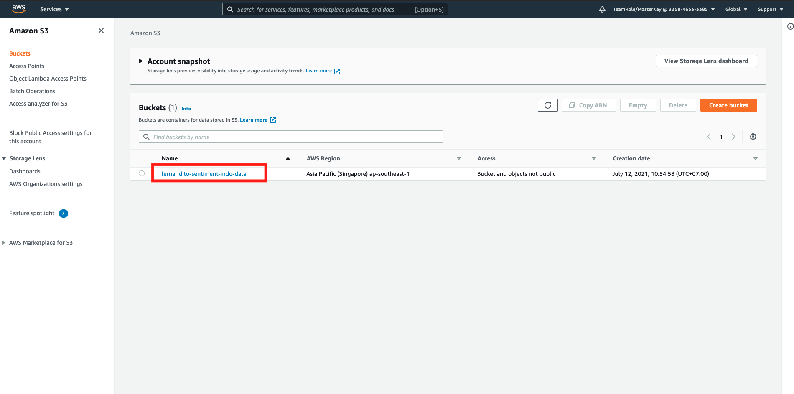
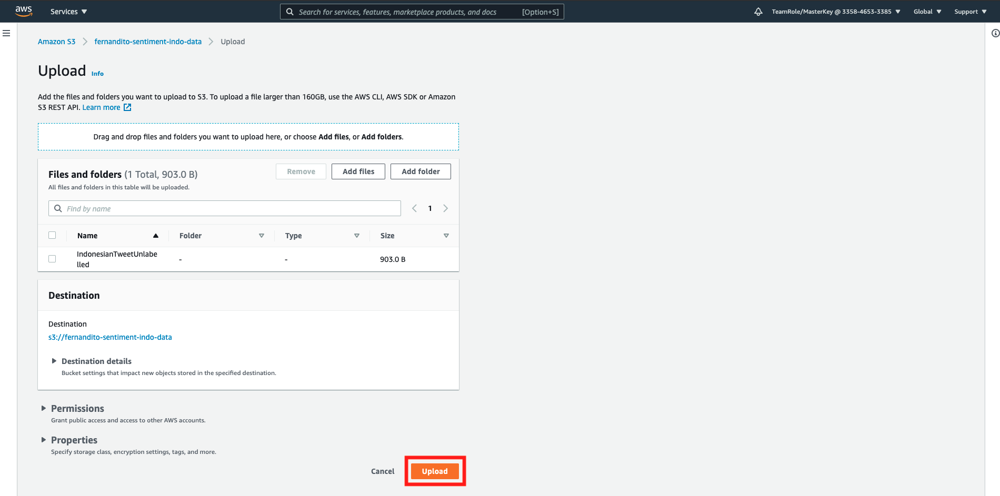
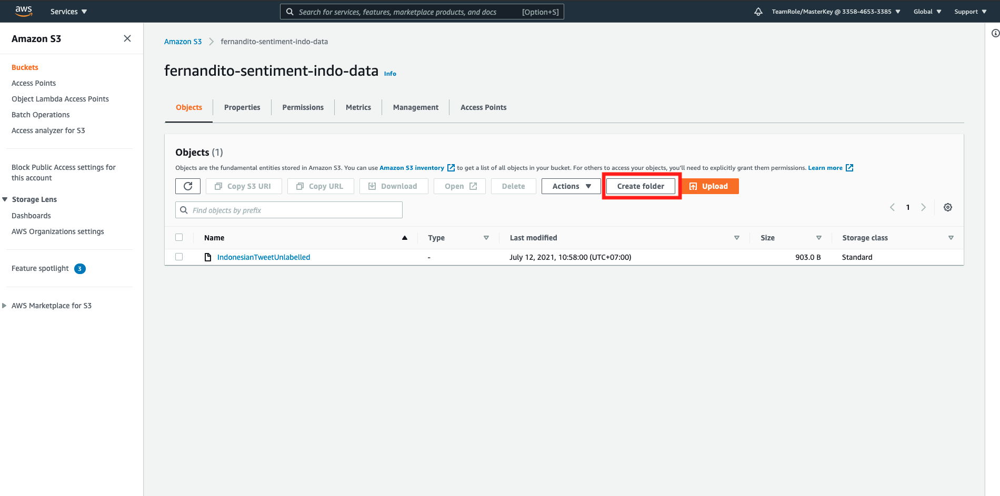
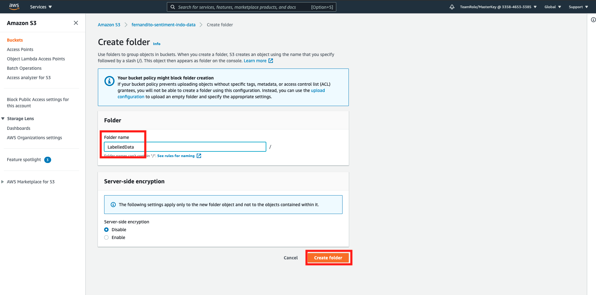

## Data Source Configuration

For data source, we are going to use data from a source. the data is about tweets from indonesian. We are going to detect the sentiment based on their tweets.

1. Please download this [Indonesian Tweet dataset](../files/SentimentAnalysis-IndonesiaData.zip). Unzip it once you are done.
2. Alternatively, if you can't unzip files, here is the [data for label in SageMaker Ground Truth](../files/IndonesianTweetUnlabelled) and [data for ML Process on SageMaker and AI Service](../files/IndonesianTweetLabelled)
3. go to [AWS Console](https://ap-southeast-1.console.aws.amazon.com/console/home?region=ap-southeast-1)
4. type `S3` at the search bar, and click the `S3` service.

5. Or, you can click [this link to S3 Console](https://s3.console.aws.amazon.com/s3/home?region=ap-southeast-1#)
6. in S3 Console, click `Create Bucket`

7. fill your bucket name with `<yourname>-sentiment-indo-data`

Bear in mind that each of the bucket names in S3 must be unique, so if your 1st time doesn't work, please change the name.

8. Specify the region to `Singapore`

9. scroll down and click `Create Bucket`

Once the storage is ready, we are going to upload it.

10. click your bucket name `<yourname>-sentiment-indo-data`

First, we are going to upload the unlabelled data, for sagemaker ground truth.

11. click `Upload`
12. upload your `IndonesianTweetUnlabelled` file by drag and drop to the console, or you can click `Add files`
13. click `Upload` and click `Close` once it's done.

Now, we are going to upload a data for machine learning on SageMaker and AI Service.

14. in your bucket, click `Create Folder`

15. fill the folder name with `LabelledData`
16. click `Create folder`

17. click the folder name `LabelledData`
18. click `Upload`
19. upload your `IndonesianTweetLabelled` file by drag and drop to the console, or you can click `Add files`
20. click `Upload` and click `Close` once it's done.