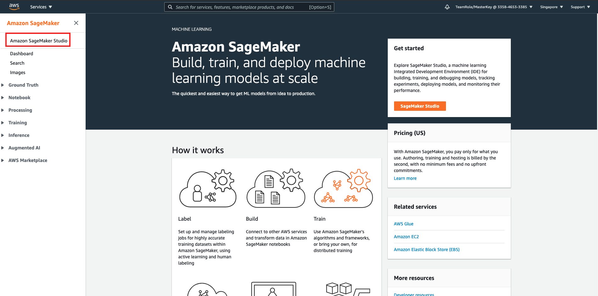
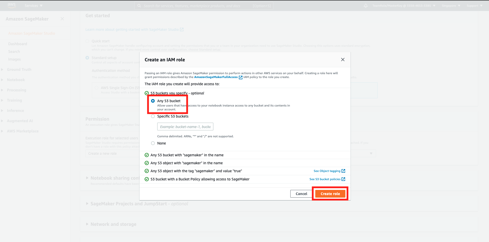
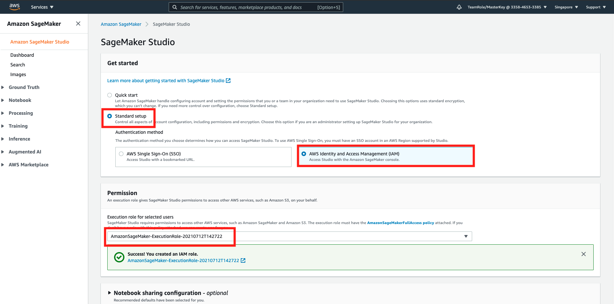
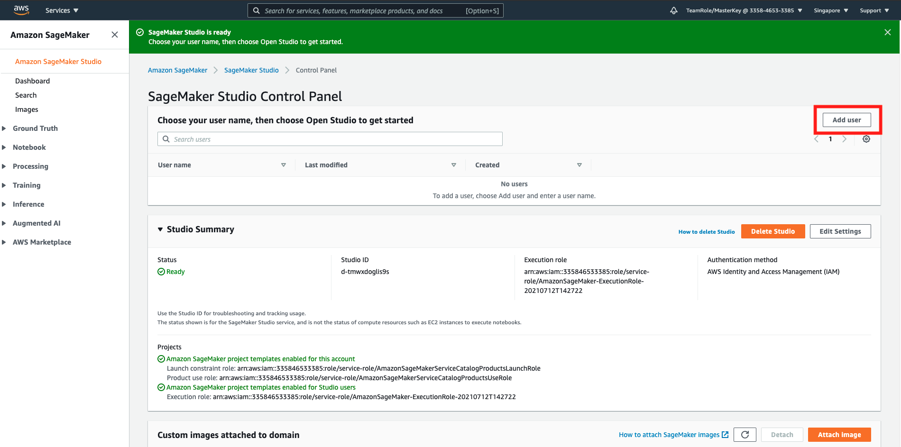
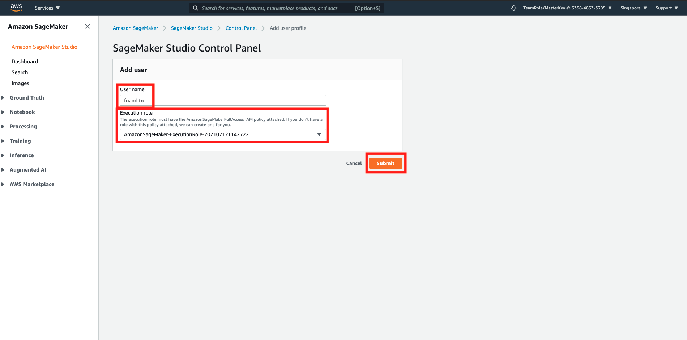
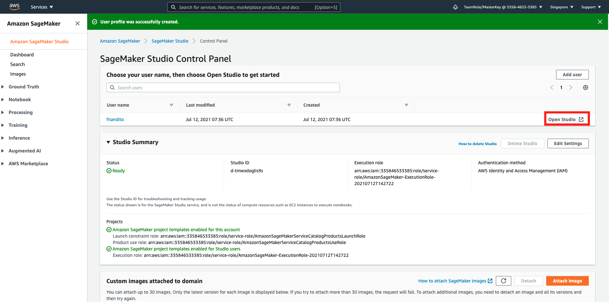
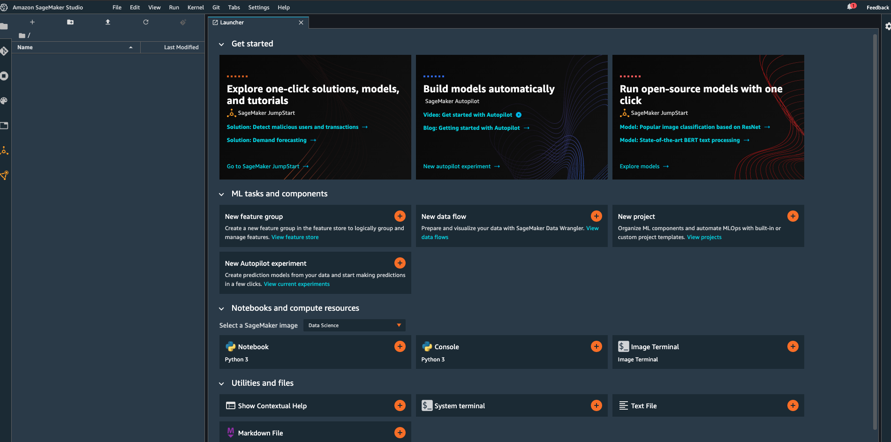
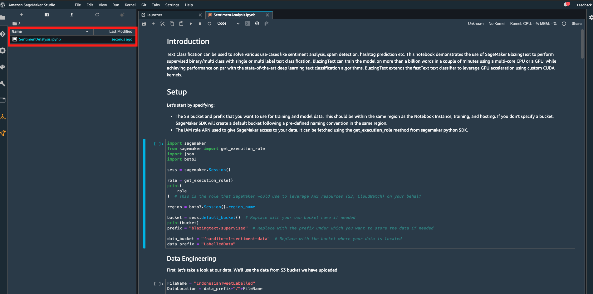
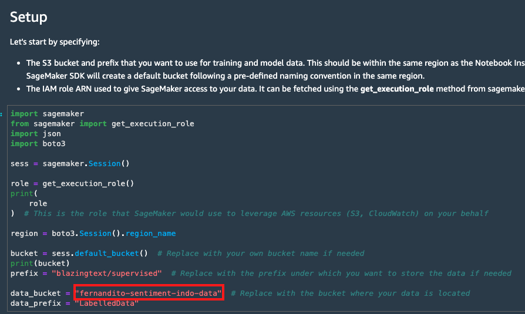
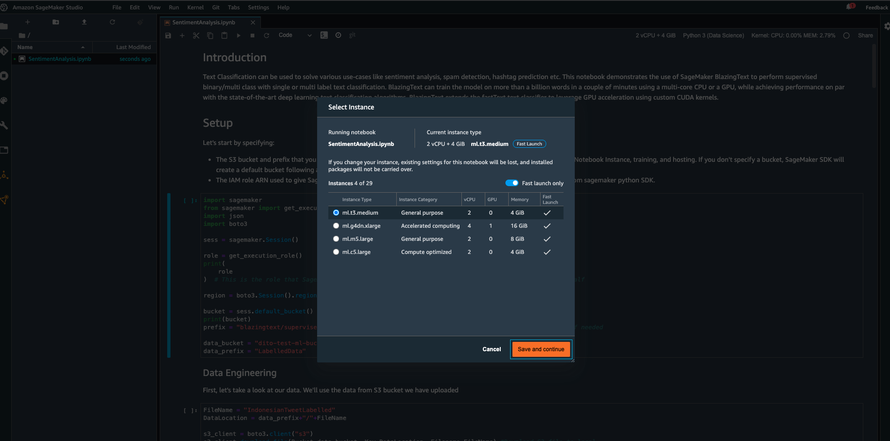

## Data Engineering, Training, and Deployment using SageMaker

Note: this is using ap-southeast-1, also working on us-east-1

In this workshop, we are going to use SageMaker Studio, an IDE for Machine Learning on AWS. this includes notebook creation, git repository integration, and terminal access.

1. go to [SageMaker Console](https://ap-southeast-1.console.aws.amazon.com/sagemaker/home?region=ap-southeast-1#/landing)
2. click `Amazon SageMaker Studio` on the left menu

3. click `Standard Setup`
4. in authentication method, choose `AWS Identity and Access Management (IAM)`
5. in Permission, click `Create new role`
6. choose `Any S3 bucket`
7. click `Create role`

it will display the screen like this:

8. click `Submit`

it will be loading for 5 until 10 minutes. Once it's done, let's create a user.

9. click `Add User`

10. in username, fill it with your name
11. in role, fill the role with the previous role you have created (`AmazonSageMaker-ExecutionRole-XXXXXXXX`)
12. click `Submit`

Once it's ready, let's try to open the studio

13. click `Open Studio`

this will need around 5 until 20 minutes, to spin up the server for the IDE to run properly.

once it's done, here is the review page.

we are going to create one machine learning on SageMaker using notebook.

14. Download [this ipynb notebook](../files/SentimentAnalysis.ipynb) on your local (Please click open in a new window, click raw, and save as .ipynb file)
15. upload the notebook to sagemaker studio by drag and drop the notebook.
16. double click the notebook. Follow the instruction inside the notebook.

17. for kernel, please choose `Python 3 (Data Science)` located at the top right of notebook.

18. don't forget to change the S3 bucket name to your bucket `<yourname>-sentiment-indo-data`

19. choose the instance type above with the name `Unknown` and choose `t3.medium` and click `Save and continue`

[BACK TO WORKSHOP GUIDE :house:](../README.md)

[BACK TO PREVIOUS GUIDE :arrow_left:](DataLabelling.md)